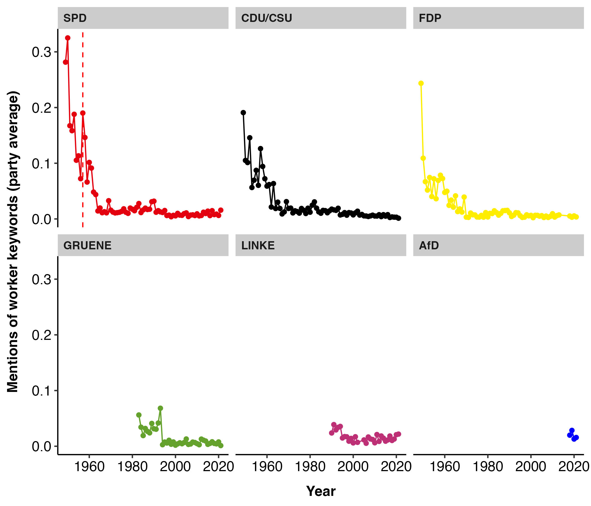

# Working-Class Appeals in German Parliamentary Debates

## Overview

This project examines how class-related rhetoric in the German Bundestag has shifted in response to long-term deindustrialization, leveraging parliamentary debate transcripts (1949–2021).

Using a dictionary-based text analysis combined with time-series regression modeling, the study evaluates whether parties reduce explicit working-class appeals as industrial employment declines and whether they substitute such language with broader, more inclusive terminology.

The workflow is fully reproducible using `renv`.

---

## Research Question

How has the decline of industrial employment in Germany affected the use of working-class rhetoric in parliamentary debates?

Specifically:

- Do parties decrease explicit “worker” language over time?
- Do they shift toward broader “employee” terminology consistent with catch-all strategies?

---

## Data

### Parliamentary Speeches
- GermaParl dataset (German Bundestag debates, 1949–2021)
- West Germany only prior to reunification (1990)
- Speeches by the Bundestag chair excluded

### Labor Market Data
- Share of industrial workers in the labor force (Destatis)

### Control Variables
- Unemployment rate
- Government vs. opposition status

---

## Methodology

### Text Analysis
- Dictionary-based identification of direct working-class appeals (e.g., “Arbeiter”)
- Dictionary-based identification of indirect appeals (e.g., “Arbeitnehmer”)
- Manual validation of dictionary terms
- Annual aggregation of speech data
- Normalization by number of MPs per party and year

### Statistical Modeling
- Generalized Least Squares (GLS)
- AR(1) autocorrelation structure
- Time spline (4 degrees of freedom)
- Controls for economic conditions and party competition

## Example Output



---

## Reproducibility

This project uses `renv` for dependency management.

To reproduce the analysis:

```r
renv::restore()
source("run_all.R")